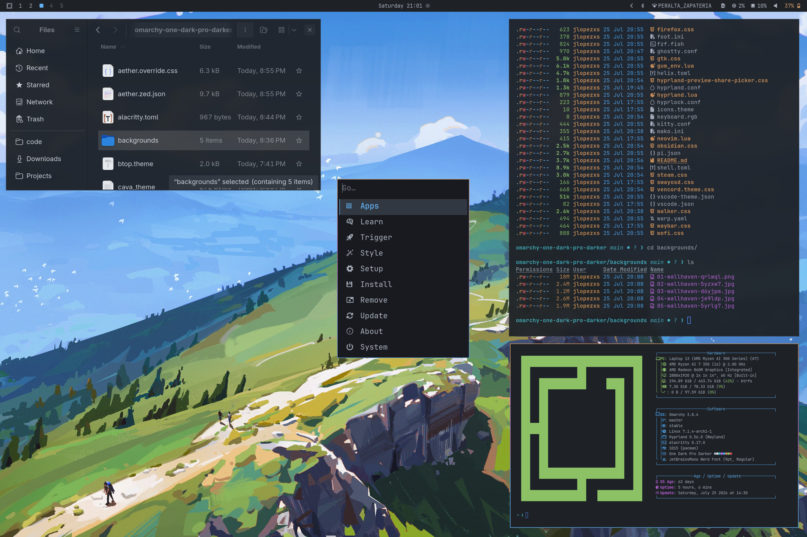
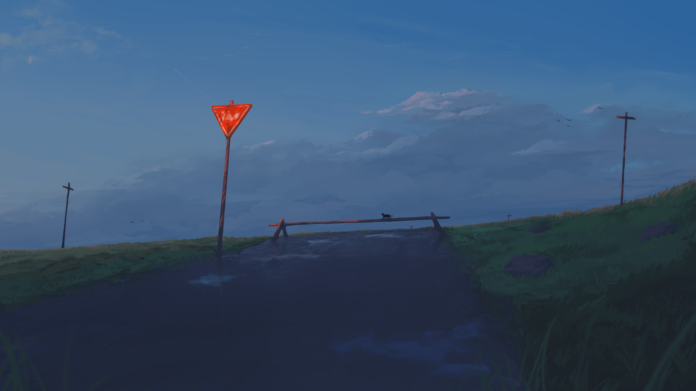
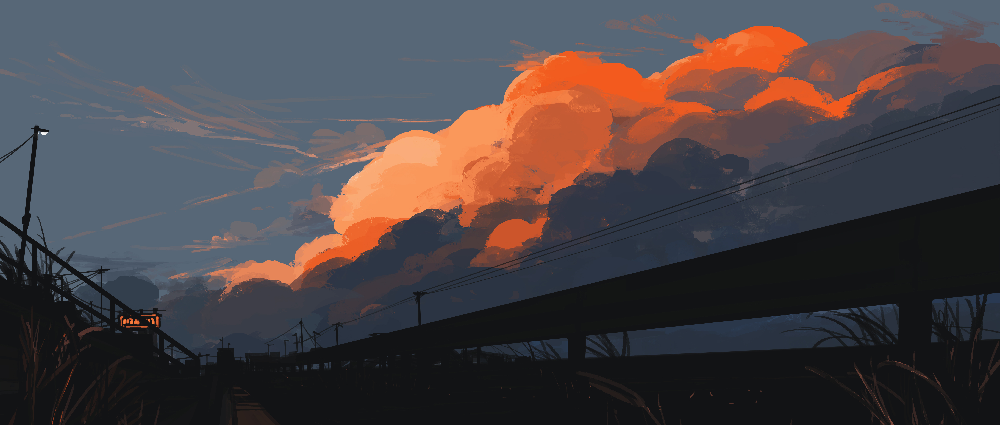
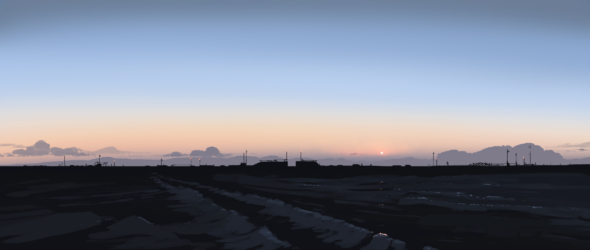

<div align="center">

# 🌑 One Dark Pro Darker

> *"Atom's iconic One Dark — pushed deeper into the night."*

A carefully crafted **Hyprland** theme for **Omarchy** — the classic **One Dark Pro Darker** palette  
with cool blues, soft magentas, and warm orange accents on a deeper charcoal canvas.

<br>



</div>

## Install

Use the Omarchy theme installer:

```bash
omarchy-theme-install https://github.com/jlopezxs/omarchy-one-dark-pro-darker-theme
```

## ✨ Features


| | Feature | Description |
|:---:|:---|:---|
| 🪟 | **Hyprland** | Active border gradient, group bar, Walker animations, blur, and opacity tuning (`hyprland.conf`) |
| 🔒 | **Hyprlock** | Lock screen styled to the One Dark Pro Darker palette |
| 📊 | **Waybar** | Status bar colors matched to the theme |
| 💻 | **Terminals** | Alacritty · Kitty · Ghostty · Foot · Warp |
| 🐚 | **Shell & CLI** | Fish colors · fzf · Gum · cava · btop |
| 🚀 | **Launchers** | Walker and Wofi with matching UI chrome |
| 🎨 | **GTK & Desktop** | GTK/Adwaita · Chromium · Firefox · Mako · SwayOSD · icons |
| 📝 | **Editors** | Neovim · Helix · VS Code · Zed |
| 🎮 | **Extras** | Steam · Vencord · Obsidian · Pi · Omarchy shell · Aether overrides |
| 🖼️ | **Wallpapers** | Curated dark wallpapers bundled in `backgrounds/` |

---

## Neovim note

`neovim.lua` uses [`olimorris/onedarkpro.nvim`](https://github.com/olimorris/onedarkpro.nvim) with the `onedark_dark` colorscheme and background overrides matching this theme (`#23272e` / `#1e2227`).

## 🎨 Color Palette

| Swatch | Name | Hex |
|:---:|:---|:---:|
|  | Background | `#1e2227` |
|  | Dark Background | `#181a1f` |
|  | Foreground | `#abb2bf` |
|  | Accent Blue | `#61afef` |
|  | Cursor | `#528bff` |
|  | Red | `#e05561` |
|  | Green | `#8cc265` |
|  | Yellow | `#d18f52` |
|  | Orange | `#d19a66` |
|  | Magenta | `#c162de` |
|  | Cyan | `#42b3c2` |
|  | Muted | `#495162` |


Palette from [`oneDarkProDarker.ts`](https://github.com/Binaryify/OneDark-Pro/blob/master/src/themes/data/oneDarkProDarker.ts). Full tokens live in [`colors.toml`](colors.toml).

## Screenshots

| | |
| --- | --- |
|  |  |
|  | |

## Wallpapers

| | | |
| --- | --- | --- |
|  |  |  |
|  |  | |

## Attribution

- One Dark Pro palette by Binaryify: <https://github.com/Binaryify/OneDark-Pro>
- Multi-app theme layout inspired by [omarchy-miasma-theme](https://github.com/OldJobobo/omarchy-miasma-theme)
- README intro style inspired by [Copper Night](https://github.com/hembramnishant50-glitch/omarchy-coppernight-theme)
